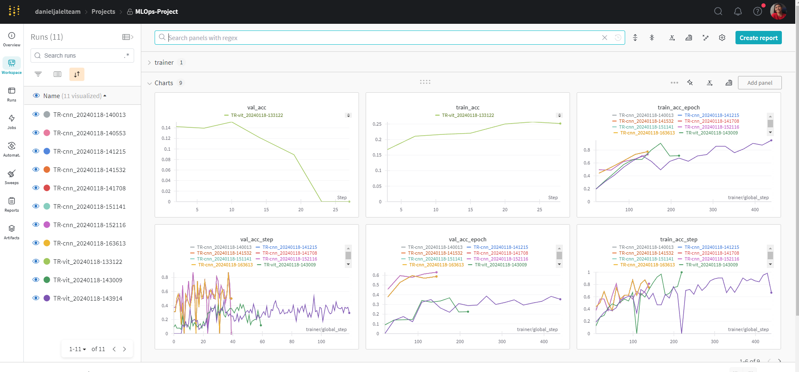
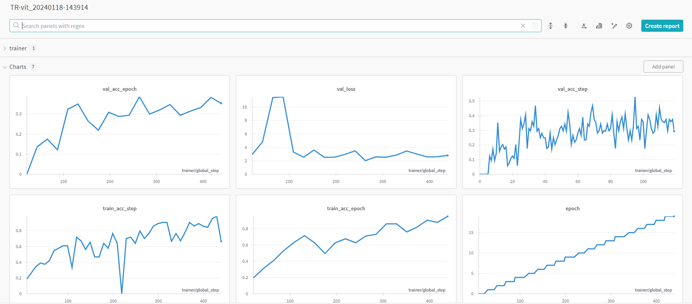
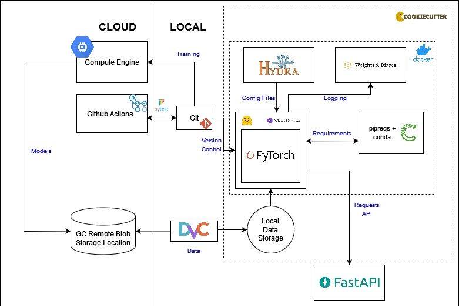

# Exam template for 02476 Machine Learning Operations

This is the report template for the exam. Please only remove the text formatted as with three dashes in front and behind
like:

```--- question 1 fill here ---```

where you instead should add your answers. Any other changes may have unwanted consequences when your report is auto
generated in the end of the course. For questions where you are asked to include images, start by adding the image to
the `figures` subfolder (please only use `.png`, `.jpg` or `.jpeg`) and then add the following code in your answer:

```markdown

```

In addition to this markdown file, we also provide the `report.py` script that provides two utility functions:

Running:

```bash
python report.py html
```

will generate an `.html` page of your report. After deadline for answering this template, we will autoscrape
everything in this `reports` folder and then use this utility to generate an `.html` page that will be your serve
as your final handin.

Running

```bash
python report.py check
```

will check your answers in this template against the constrains listed for each question e.g. is your answer too
short, too long, have you included an image when asked to.

For both functions to work it is important that you do not rename anything. The script have two dependencies that can
be installed with `pip install click markdown`.

## Overall project checklist

The checklist is *exhaustic* which means that it includes everything that you could possible do on the project in
relation the curricilum in this course. Therefore, we do not expect at all that you have checked of all boxes at the
end of the project.

### Week 1

* [ ] Create a git repository
* [ ] Make sure that all team members have write access to the github repository
* [ ] Create a dedicated environment for you project to keep track of your packages
* [ ] Create the initial file structure using cookiecutter
* [ ] Fill out the `make_dataset.py` file such that it downloads whatever data you need and
* [ ] Add a model file and a training script and get that running
* [ ] Remember to fill out the `requirements.txt` file with whatever dependencies that you are using
* [ ] Remember to comply with good coding practices (`pep8`) while doing the project
* [ ] Do a bit of code typing and remember to document essential parts of your code
* [ ] Setup version control for your data or part of your data
* [ ] Construct one or multiple docker files for your code
* [ ] Build the docker files locally and make sure they work as intended
* [ ] Write one or multiple configurations files for your experiments
* [ ] Used Hydra to load the configurations and manage your hyperparameters
* [ ] When you have something that works somewhat, remember at some point to to some profiling and see if
      you can optimize your code
* [ ] Use Weights & Biases to log training progress and other important metrics/artifacts in your code. Additionally,
      consider running a hyperparameter optimization sweep.
* [ ] Use Pytorch-lightning (if applicable) to reduce the amount of boilerplate in your code

### Week 2

* [ ] Write unit tests related to the data part of your code
* [ ] Write unit tests related to model construction and or model training
* [ ] Calculate the coverage.
* [ ] Get some continuous integration running on the github repository
* [ ] Create a data storage in GCP Bucket for you data and preferable link this with your data version control setup
* [ ] Create a trigger workflow for automatically building your docker images
* [ ] Get your model training in GCP using either the Engine or Vertex AI
* [ ] Create a FastAPI application that can do inference using your model
* [ ] If applicable, consider deploying the model locally using torchserve
* [ ] Deploy your model in GCP using either Functions or Run as the backend

### Week 3

* [ ] Check how robust your model is towards data drifting
* [ ] Setup monitoring for the system telemetry of your deployed model
* [ ] Setup monitoring for the performance of your deployed model
* [ ] If applicable, play around with distributed data loading
* [ ] If applicable, play around with distributed model training
* [ ] Play around with quantization, compilation and pruning for you trained models to increase inference speed

### Additional

* [ ] Revisit your initial project description. Did the project turn out as you wanted?
* [ ] Make sure all group members have a understanding about all parts of the project
* [ ] Uploaded all your code to github

## Group information

### Question 1
> **Enter the group number you signed up on <learn.inside.dtu.dk>**
>
> Answer:

Group 12

### Question 2
> **Enter the study number for each member in the group**
>
> Example:
>
> *sXXXXXX, sXXXXXX, sXXXXXX*
>
> Answer:

s194127, s185382, s194149, s194291, s194139

### Question 3
> **What framework did you choose to work with and did it help you complete the project?**
>
> Answer length: 100-200 words.
>
> Example:
> *We used the third-party framework ... in our project. We used functionality ... and functionality ... from the*
> *package to do ... and ... in our project*.
>
> Answer:

We used the transformers framework by Hugging Face to implement the ViT architecture in our project. This framework allowed us to use pre-trained models as well as providing the ability to fine-tune them. We used transformers in hope of achieving more state-of-the-art results.  

## Coding environment

> In the following section we are interested in learning more about you local development environment.

### Question 4

> **Explain how you managed dependencies in your project? Explain the process a new team member would have to go**
> **through to get an exact copy of your environment.**
>
> Answer length: 100-200 words
>
> Example:
> *We used ... for managing our dependencies. The list of dependencies was auto-generated using ... . To get a*
> *complete copy of our development environment, one would have to run the following commands*
>
> Answer:

We used conda and pip for managing our dependencies. The list of dependencies was auto-generated using pipreqs which generated a requirements txt file which a new team member could use to install the required packages on their device. To get a complete copy of our environment, the following commands are nessecary: 1. `conda create -n my_env python=3.10`, `pip install -r requirements.txt` from the root directory. 

### Question 5

> **We expect that you initialized your project using the cookiecutter template. Explain the overall structure of your**
> **code. Did you fill out every folder or only a subset?**
>
> Answer length: 100-200 words
>
> Example:
> *From the cookiecutter template we have filled out the ... , ... and ... folder. We have removed the ... folder*
> *because we did not use any ... in our project. We have added an ... folder that contains ... for running our*
> *experiments.*
> Answer:

--- question 5 fill here ---

### Question 6

> **Did you implement any rules for code quality and format? Additionally, explain with your own words why these**
> **concepts matters in larger projects.**
>
> Answer length: 50-100 words.
>
> Answer:

Yes, we employed a method where all code was written into functions, with even the main code being a function. Another rule we employed is that all pathing is relative the root directory, which helped generalize the pathing for saving and loading files in the correct location. This, however, means that all code should be run from the root folder. 

## Version control

> In the following section we are interested in how version control was used in your project during development to
> corporate and increase the quality of your code.

### Question 7

> **How many tests did you implement and what are they testing in your code?**
>
> Answer length: 50-100 words.
>
> Example:
> *In total we have implemented X tests. Primarily we are testing ... and ... as these the most critical parts of our*
> *application but also ... .*
>
> Answer:

In total we have implemented 6 tests. 3 tests were related to the data part of our code and 3 tests were related to the model construction of our code. We didn't do a lot of testing, however, we believe that the tests we ended up doing were all essential parts. For testing the data part of our code, we included tests that would check if the number of images matched the number of annotations, which is extremely important. We also included tests to check whether the image tensors and annotation tensors were the correct dimensions. For the model we tested the correctness and feasibility of the construction of the models. For this we would check whether the output features of one layer actually corresponded with the input features of the subsequent layer, to ensure that the model construction was consistent and cohesive.

### Question 8

> **What is the total code coverage (in percentage) of your code? If you code had an code coverage of 100% (or close**
> **to), would you still trust it to be error free? Explain you reasoning.**
>
> Answer length: 100-200 words.
>
> Example:
> *The total code coverage of code is X%, which includes all our source code. We are far from 100% coverage of our **
> *code and even if we were then...*
>
> Answer:

As stated in the answer for 'Question 7' we only did testing for the data part of our code as well as the model construction. And we only did 6 unittests overall. We did generate a coverage report and it states that only 14% of the code is covered with the testing of the data part our code. And 33% of the code is covered with the testing related to the model construction.  

### Question 9

> **Did you workflow include using branches and pull requests? If yes, explain how. If not, explain how branches and**
> **pull request can help improve version control.**
>
> Answer length: 100-200 words.
>
> Example:
> *We made use of both branches and PRs in our project. In our group, each member had an branch that they worked on in*
> *addition to the main branch. To merge code we ...*
>
> Answer:

Yes, we made use of branches and pull requests in our project. Individual assignments were handed out regarding different capabilities we wanted to build up. So branches were named after the task and not person specific, however the tasks were delegated to a specific person to avoid potential conflicts. We made sure that the master branch was always functioning, and if a bug occured due to the merging of two branches, this fix would become top priority. 

### Question 10

> **Did you use DVC for managing data in your project? If yes, then how did it improve your project to have version**
> **control of your data. If no, explain a case where it would be beneficial to have version control of your data.**
>
> Answer length: 100-200 words.
>
> Example:
> *We did make use of DVC in the following way: ... . In the end it helped us in ... for controlling ... part of our*
> *pipeline*
>
> Answer:

Yes, we did employ DVC for data management in our project and it significantly improved our workflow. In our case the data always remained the same, so version control of the data wasn't strictly necessary, however, we found it very useful for storage efficiency and helping save storage space. The combination of DVC with our ML code in Git also ensured great reproducibility. Anyone on the team could easily reproduce and get the data by pulling the data with DVC. 

### Question 11

> **Discuss you continues integration setup. What kind of CI are you running (unittesting, linting, etc.)? Do you test**
> **multiple operating systems, python version etc. Do you make use of caching? Feel free to insert a link to one of**
> **your github actions workflow.**
>
> Answer length: 200-300 words.
>
> Example:
> *We have organized our CI into 3 separate files: one for doing ..., one for running ... testing and one for running*
> *... . In particular for our ..., we used ... .An example of a triggered workflow can be seen here: <weblink>*
>
> Answer:

As previously stated, we divided the unittests into two categories: one pertaining to the data aspect of our code and the other concerning the model construction. Therefore we created two separate .yaml files within the `.github/workflows` directory, which we named "Run Test Dataloading" and "Run Test Model" to correspond to these respective categories. Additionally, we configured these .yaml files to automate the execution of these actions every Monday at 14:00, ensuring that both data retrieval using DVC and the associated unittests continue to function smoothly. This setup also serves as a failsafe against unintentional model and data modifications that could potentially break the system.

## Running code and tracking experiments

> In the following section we are interested in learning more about the experimental setup for running your code and
> especially the reproducibility of your experiments.

### Question 12

> **How did you configure experiments? Did you make use of config files? Explain with coding examples of how you would**
> **run a experiment.**
>
> Answer length: 50-100 words.
>
> Example:
> *We used a simple argparser, that worked in the following way: python my_script.py --lr 1e-3 --batch_size 25*
>
> Answer:

--- question 12 fill here ---

### Question 13

> **Reproducibility of experiments are important. Related to the last question, how did you secure that no information**
> **is lost when running experiments and that your experiments are reproducible?**
>
> Answer length: 100-200 words.
>
> Example:
> *We made use of config files. Whenever an experiment is run the following happens: ... . To reproduce an experiment*
> *one would have to do ...*
>
> Answer:

We use the config files to ensure reproducibility with respect to the models themselves, as this is the where the overarching parameters and architecture is defined. To reproduce an expirement one can inspect the results from `weights and biases` where the config file is saved and from which you would be able to apply the same parameters in another experiment. Training is made deterministic with the help of pytorch lightning, in which we have activated this feature. Additionally we have made use of `seed_everything` from pytorch lightning, which enables a specific seed for all the applied libraries so that results can be reproduced. 

### Question 14

> **Upload 1 to 3 screenshots that show the experiments that you have done in W&B (or another experiment tracking**
> **service of your choice). This may include loss graphs, logged images, hyperparameter sweeps etc. You can take**
> **inspiration from [this figure](figures/wandb.png). Explain what metrics you are tracking and why they are**
> **important.**
>
> Answer length: 200-300 words + 1 to 3 screenshots.
>
> Example:
> *As seen in the first image when have tracked ... and ... which both inform us about ... in our experiments.*
> *As seen in the second image we are also tracking ... and ...*
>
> Answer:

We have in this project made use of the experiment tracking framework: Weights and Biases. A screenshot of our enviroment as of 19/01/24 is shown down under:


Here it is clear that we have tracked several runs of multiple models for our dog breed classifier. Looking at the image we have tracked trainning and validation loss and accuracy. These are the most important parameters for us to trace as they show if our model is indeed training and if it has begun to overfit.

Using W&B we had the ability to track our models live even though training was not local (either cloud or HPC). We also used it for ablition studies of our models as it is a super easy way to track correlation between change and consequences on our accuracy. As we had two different model architectures we wanted to test we made different names and config settings so we could track it in W&B. The result of the best custom CNN is shown in the figure down under where we see validation accuracies of approximately 55%


The result of the best custom ViT is shown in the figure down under where we see validation accuracies of approximately 35%. Note however the small amount of epochs as our models have not converged yet.




### Question 15

> **Docker is an important tool for creating containerized applications. Explain how you used docker in your**
> **experiments? Include how you would run your docker images and include a link to one of your docker files.**
>
> Answer length: 100-200 words.
>
> Example:
> *For our project we developed several images: one for training, inference and deployment. For example to run the*
> *training docker image: `docker run trainer:latest lr=1e-3 batch_size=64`. Link to docker file: <weblink>*
>
> Answer:

We used docker primarily to enable using the different scripts in the cloud. This could greatly simplify the process as we could create images for data loading, training and deployment where we could "simply" upload the docker image to the cloud. We could also use this function locally to ensure that the code would be able to run on any of our computers and thereby reduce potential bugfixing issues. During development we encountered memory issues whilst deploying our images locally so a command to run the trainer became:

`docker run --shm-size=1g --name <experiment_name> -e WANDB_API_KEY=<insert_API_KEY> trainer:latest`

Where `--sshm-size=1g` increased the share of memory given to the VM enabling the run. Additionally some issues were encountered concerning the API key however these were solved as well. 

### Question 16

> **When running into bugs while trying to run your experiments, how did you perform debugging? Additionally, did you**
> **try to profile your code or do you think it is already perfect?**
>
> Answer length: 100-200 words.
>
> Example:
> *Debugging method was dependent on group member. Some just used ... and others used ... . We did a single profiling*
> *run of our main code at some point that showed ...*
>
> Answer:

The first and most important step is to read the error printed out in the terminal this tells us a lot, if not all the information we need to solve the bug. If the bug is not obvious from the error message, we then continue with different tools like print statements, feature analysis and chatGPT. This has in all cases so far been enough. If this was not enough, we would go to the debugger and try following the code through the interactive tool. If our code was more complex or we wanted to be better at scaling our code we would probably try and do some profiling on it. 

## Working in the cloud

> In the following section we would like to know more about your experience when developing in the cloud.

### Question 17

> **List all the GCP services that you made use of in your project and shortly explain what each service does?**
>
> Answer length: 50-200 words.
>
> Example:
> *We used the following two services: Engine and Bucket. Engine is used for... and Bucket is used for...*
>
> Answer:

We used the Engine and the Bucket. We mostly used the bucket as they were nice for the setup of DVC for data source control and we also could use the buckets to save the finished model weights after training. This helped us make sure we could train non-locally like the cloud VM´s and the HPC. We also used the Engine for training of small prototype models but as we scaled the project we could not train it there any longer. We then made a hard push to finish docker, W&B and other nessesary steps so we could again train it on the cloud but we never made it to the actual training again and this would be the next step in future works.

### Question 18

> **The backbone of GCP is the Compute engine. Explained how you made use of this service and what type of VMs**
> **you used?**
>
> Answer length: 100-200 words.
>
> Example:
> *We used the compute engine to run our ... . We used instances with the following hardware: ... and we started the*
> *using a custom container: ...*
>
> Answer:

--- question 18 fill here ---

### Question 19

> **Insert 1-2 images of your GCP bucket, such that we can see what data you have stored in it.**
> **You can take inspiration from [this figure](figures/bucket.png).**
>
> Answer:

--- question 19 fill here ---

### Question 20

> **Upload one image of your GCP container registry, such that we can see the different images that you have stored.**
> **You can take inspiration from [this figure](figures/registry.png).**
>
> Answer:

--- question 20 fill here ---

### Question 21

> **Upload one image of your GCP cloud build history, so we can see the history of the images that have been build in**
> **your project. You can take inspiration from [this figure](figures/build.png).**
>
> Answer:

--- question 21 fill here ---

### Question 22

> **Did you manage to deploy your model, either in locally or cloud? If not, describe why. If yes, describe how and**
> **preferably how you invoke your deployed service?**
>
> Answer length: 100-200 words.
>
> Example:
> *For deployment we wrapped our model into application using ... . We first tried locally serving the model, which*
> *worked. Afterwards we deployed it in the cloud, using ... . To invoke the service an user would call*
> *`curl -X POST -F "file=@file.json"<weburl>`*
>
> Answer:

We managed to deploy the model locally using a local API and prepared these for training, predicting and so on in the cloud. However, we encountered credential issues which we were unable to solve in time and prevented the docker images/containers from uploading and dowloading results from our gcp bucket. We also encountered numerous issues with making `hydra` work together with the API environment, as this differed in a complex manner in comparison to the local repository. 

In conclusion, the model could be deployed locally both directly by running the code and by running docker images, but not with an API. 

### Question 23

> **Did you manage to implement monitoring of your deployed model? If yes, explain how it works. If not, explain how**
> **monitoring would help the longevity of your application.**
>
> Answer length: 100-200 words.
>
> Example:
> *We did not manage to implement monitoring. We would like to have monitoring implemented such that over time we could*
> *measure ... and ... that would inform us about this ... behaviour of our application.*
>
> Answer:

--- question 23 fill here ---

### Question 24

> **How many credits did you end up using during the project and what service was most expensive?**
>
> Answer length: 25-100 words.
>
> Example:
> *Group member 1 used ..., Group member 2 used ..., in total ... credits was spend during development. The service*
> *costing the most was ... due to ...*
>
> Answer:

--- question 24 fill here ---

## Overall discussion of project

> In the following section we would like you to think about the general structure of your project.

### Question 25

> **Include a figure that describes the overall architecture of your system and what services that you make use of.**
> **You can take inspiration from [this figure](figures/overview.png). Additionally in your own words, explain the**
> **overall steps in figure.**
>
> Answer length: 200-400 words
>
> Example:
>
> *The starting point of the diagram is our local setup, where we integrated ... and ... and ... into our code.*
> *Whenever we commit code and puch to github, it auto triggers ... and ... . From there the diagram shows ...*
>
> Answer:



The starting point of the diagram is our local PyTorch application, which we wrapped in the PyTorch Lightning framework to reduce boilerplate code. Here we additionally also used the `timm` framework for using the pre-trained models. The diagram also show how the local application is integrated with Hydra for using config files and Weights and Biases for logging and tracking of experiments. A new environment can be initialized using either Conda or `pip`. In our case we opted for `pipreqs` for finding the package requirements.  All of these components are encapsulated within Docker containers to ensure consistency across different development environments. Additional feature of our deployment also allows the user to start a local server and do inference using FastAPI.

On the Cloud side one can see the inclusion of GitHub Actions that helps to automate our workflows for continuous integration. One can also see how we also managed to integrate a GCP Compute Engine in order to train over the cloud. The output models will be stored in a GC Remote Blob Storage where the data is also stored. 


### Question 26

> **Discuss the overall struggles of the project. Where did you spend most time and what did you do to overcome these**
> **challenges?**
>
> Answer length: 200-400 words.
>
> Example:
> *The biggest challenges in the project was using ... tool to do ... . The reason for this was ...*
>
> Answer:

One of our primary struggles of the project was the incorporation of Hydra within our system. We used Hydra for managing multiple configurations for various experiments, and ensuring reproducibility. However, we found it somewhat cumbersome when it came to integrating with various components of our code including the inference with FastAPI and the unittesting. 

### Question 27

> **State the individual contributions of each team member. This is required information from DTU, because we need to**
> **make sure all members contributed actively to the project**
>
> Answer length: 50-200 words.
>
> Example:
> *Student sXXXXXX was in charge of developing of setting up the initial cookie cutter project and developing of the*
> *docker containers for training our applications.*
> *Student sXXXXXX was in charge of training our models in the cloud and deploying them afterwards.*
> *All members contributed to code by...*
>
> Answer:

Student s194127 has worked on the Docker files used for containerization, the checkpoints included in the training script for model saving, dvc integration for data version control and lastly the training script.

Student s185382 has worked with the fastAPI for usage of the model, the buckets where data has been stored, the predictor script for inference and the deployment of the model both locally and in the cloud

Student s194149 has worked on dataloading, dvc data version control, integration of buckets and dvc, hydra for use with config files and the training script

Student s194291 has worked with integration of Weights and Biases, the chosen unittests for our pipeline and CI in github actions for our repository

Student s194139 has worked with dataloading, building models in the model.py script and testing them, constructing docker files for containerization and cloud training of the models in gcp

